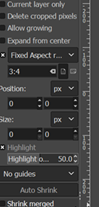
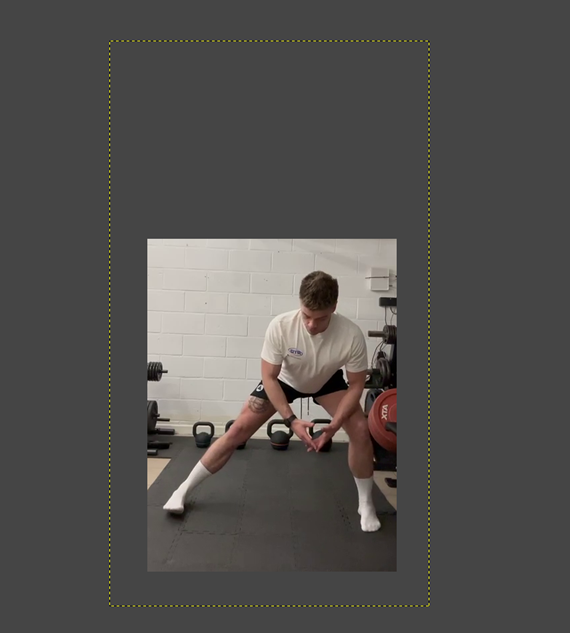

# snapshot authoring

## Prerequisites

Install the following software :

1. Vlc : https://www.videolan.org/vlc/download-windows.html
2. Gimp : https://www.gimp.org/downloads/

## Steps

### Take a snapshot

1. Open mp4 file with vlc and stop the video on the frame that represents best the exercise
2. Go to the menu video / take snapshot.  A PNG file will be saved in the picture folder.

### Edit snapshot

1. Open the gimp application
2. In the menu go to file / open and select the PNG file from the previous step

3. If the image is not in the upright position : Go to the menu Image / transform / 90 degress counter clock wise
4. Select the Crop tool (or shift+C)
5. Enable fixed aspect ratio and set 3:4 as depicted below
   

6. Select the area of interest

7. Press enter

8. go to the menu file / export as

9. Give the name of video with extension .png and export.  This file can be used as a snapshot file.
10. Check that the pixel aspect ratio is correct (499/4*3=374 in the example below)

