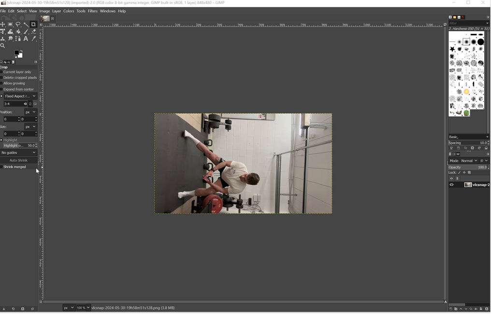
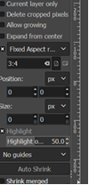
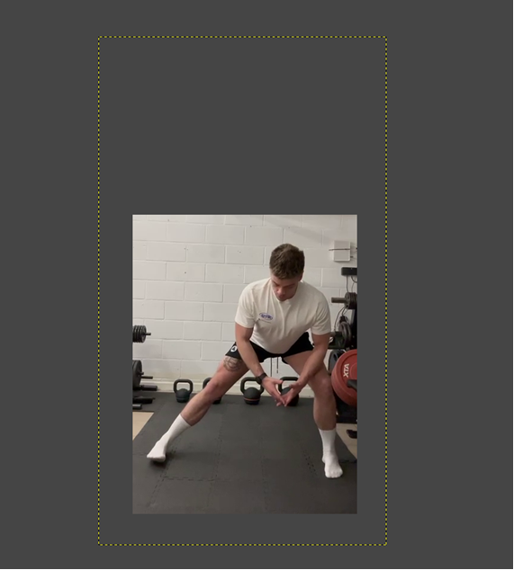
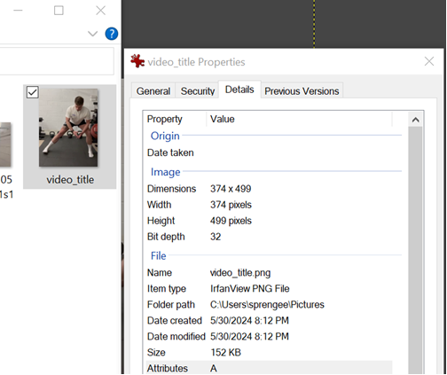

# 📽️ Video's Tabblad - Documentatie

Het **Video's**-tabblad biedt gebruikers de mogelijkheid om videobestanden te beheren. Hier kun je video's uploaden, bekijken, bewerken, verwijderen en zelfs een **Snapshot**-recreatie maken. Lees verder voor een volledige uitleg van de beschikbare functies.

---

## 🌟 Functies

### 1. **MP4-bestand uploaden**
Met deze optie kun je een videobestand in het **MP4-formaat** video uploaden. Dit is bedoeld om video's te uploaden om daarna toe te voegen aan een oefening.
**Hoe werkt het?**
1. Klik op de knop **"MP4 Uploaden"**.
2. Selecteer het gewenste MP4-bestand op je apparaat.
3. Wacht tot het uploadproces is voltooid.
4. Je video wordt toegevoegd aan je bibliotheek.
5. Een motion snapshot wordt automatisch aangemaakt van de laatste 15 seconden van de video.

Het is ook mogelijk om via de patienten smartphone app video's op te nemen en onmiddellijk aan de bibliotheek toe te voegen.  Je dient hiervoor in de app aan te melden met je coach credentials waardoor deze optie zichtbaar wordt.

> **Nota:** De totale bestandsgrootte ingenomen door video's is beperkt (default is 2Gbytes).

---

### 2. **Huidige video's beheren"**
In dit gedeelte kun je een overzicht zien van alle eerder geüploade video's. Je hebt meerdere opties om deze video's te beheren:

#### 📋 **Bekijk Video's**
- Klik op een video om deze direct af te spelen.

#### ✏️ **Bewerk Video's**
- Klik op de knop **"Bewerken"** om wijzigingen aan te brengen:
  - Pas de titel of beschrijving aan
  - Pas het interval van de motion snapshot aan. (-15= laatste 15 seconden van de video, mits stop op 0 staat) => **"KLIK OP RECREATE SNAPSHOT OM DIT TOE TE PASSEN"**, zie verder.
  - Upload zelf een statische foto als je geen motion snapshot prefereert (zie verder)
  - Selecteer een oefening waaraan je de video wil toevoegen.

#### 🗑️ **Verwijder Video's**
- Selecteer een video en klik op de knop **"Verwijderen"** om deze permanent te verwijderen uit je bibliotheek.
- **Let op:** Verwijderde video's kunnen niet worden hersteld.

#### 🔄 **Snapshot recreatie**

Click deze icon aan als het interval van de snapshot is aangepast geweest is om de snapshot te actualiseren.

#### **Reduceer video grootte (transcode video)**
De bestand grootte kan soms onnodig groot zijn afhankelijk met welk toestel ze gemaakt zijn wat maakt dat ze veel plaats op disk innemen.  Je kan deze knop gebruiken om de bestandsgrootte te beperken.

### 3. **SEARCH video's**
-Je kan ook zoeken of filteren tussen de video's door de naam van een video in te typen.

# statisch snapshots aanmaken

Indien je geen motion snapshot verkiest kan je statisch snapshot aanmaken en linken.

## Vereist software

Installeer de volgende software :

1. Vlc : https://www.videolan.org/vlc/download-windows.html
2. Gimp : https://www.gimp.org/downloads/

## Stappenplan

### Selecteer een beeld uit de video clip

1. Open mp4 file with vlc and stop the video on the frame that represents best the exercise
2. Go to the menu video / take snapshot.  A PNG file will be saved in the picture folder.

### Editeer het beeld

1. Open the gimp application
2. In the menu go to file / open and select the PNG file from the previous step

3. If the image is not in the upright position : Go to the menu Image / transform / 90 degress counter clock wise
4. Select the Crop tool (or shift+C)
5. Enable fixed aspect ratio and set 3:4 as depicted below
   

6. Select the area of interest

7. Press enter

8. go to the menu file / export as

9. Give the name of video with extension .png and export.  This file can be used as a snapshot file.
10. Check that the pixel aspect ratio is correct (499/4*3=374 in the example below)

